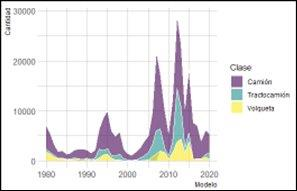

```{r setup, include=FALSE}
knitr::opts_chunk$set(echo = TRUE, warning = FALSE, 
                      fig.align = "center",
                      message = FALSE)
```

En este documento se compilan las visualizaciones realizadad en la primera edición del curso de introducción a R, impartido del 25 al 29 de mayo de 2022. Para generarlo, se utilizó RMarkdown, un lenguaje basado en texto que entiende los comandos de R. Si desean sabes más sobre como generar este tipo de documentos, pueden consultar en [Rmarkdown](https://bookdown.org/yihui/rmarkdown/)

## Ejercicios

```{r carga-librerias, echo = FALSE}
library(tidyverse)
library(ggplot2)
library(magrittr) 
library(dplyr)    
library(readxl)
library(readr)
```


1. Storytelling: Elegir una base de datos de las tres utilizadas durante el curso
(censo, copexa y tiempos de calibración) y generar dos gráficos significativos y
auto-explicativos.

### Calibración de tiempos observados y estimados
```{r tiempos}
calibracion <- read_excel("../data/tiempos_calibracion.xlsx")

calibracion %>%
  group_by(LENGTH, TPOS_MOD) %>%
  summarise(VEL_19 = sum(VEL_19)/n()) %>%
  ggplot(aes(LENGTH, TPOS_MOD)) +
  geom_point(aes(color = VEL_19, group =VEL_19))+
  geom_smooth(method = "lm")+
theme(axis.text = element_text(color = "black"),
      axis.line = element_line(color = "black"),
      panel.background = element_rect(fill = "gray"))+
scale_x_continuous("Longitud (m)",
                   limits = c(0,30),
                   expand = c(0,0)) +
  scale_y_continuous("Tiempos modelados (min)",
                     limits = c(0,30),
                     expand = c(0,0))
```

### Análisis sobre el censo
```{r censo1}

censo_cdmx <- read.csv("../data/censo.csv")

censo_filtro <- censo_cdmx %>% #Select variables
  filter(NOM_LOC == "Total del municipio") %>%
  select("NOM_MUN","VIVPAR_DES", "TVIVPAR", "POBTOT", "P_0A2", "P_3A5", "P_6A11", "P_12A14",
         "P_15A17", "P_18A24", "P_60YMAS")

censo_nom <- censo_filtro %>% #Split in characters
  select("NOM_MUN")

censo_number <- censo_filtro %>% #Separate characters that should be numbers
  select(- c("NOM_MUN"))

censo_number_n <- as.data.frame(apply(censo_number, 2, as.numeric))

censo_trabajo <- cbind(censo_nom, censo_number_n)

censo_trabajo_final <- censo_trabajo%>% #Estimated population between
  #                                       25 and 60 years old
  mutate(P_25A59 = POBTOT - (P_0A2 + P_3A5 + P_6A11 + P_12A14 +
                             P_15A17 + P_18A24 + P_60YMAS))

censo_trabajo_final <- censo_trabajo_final%>% #Estimate % uninhabited house
  mutate(PCT_VIVPAR_DES = VIVPAR_DES / TVIVPAR)

censo_trabajo_final %>%
  ggplot() + 
  geom_col(aes(x = reorder(NOM_MUN, P_25A59), y =  P_25A59, fill = PCT_VIVPAR_DES)) +
  coord_flip()+
  scale_y_continuous("Habitantes de entre 25 y 59 años")+
  scale_fill_continuous("% de viviendas deshabitadas")

censo_trabajo_final %>%
  ggplot() + 
  geom_col(aes(x = reorder(NOM_MUN, PCT_VIVPAR_DES), y =  PCT_VIVPAR_DES, fill = P_25A59)) +
  coord_flip() +
  scale_y_continuous("Porcentaje de viviendas particulares deshabitadas") +
  scale_fill_continuous("Hab. de entre 25 y 59 años")
```

### Uso del combustible en el parque automotor de Colombia (base de datos privada, comparto el código)

```{r bpar2, eval = FALSE}
library(viridis)
library(hrbrthemes)
library(ggplot2)
DATA <- read.csv("BPAR2")  ### <- asignación

#3. Gráfica distribución por combustible
ggplot(DATA, aes(x=Modelo, y=Cantidad, fill=Combustible)) + 
  geom_area(alpha=0.6 , size=.5, colour="white") +
  scale_fill_viridis(discrete = T) +
  theme_ipsum() + 
  xlim(1990, 2030)
ggtitle("The race between ...")
```


```{r bpar2-2, eval = FALSE}
#4. Gráfica distribución por clase
ggplot(DATA, aes(x=Modelo, y=Cantidad, fill=Clase)) + 
  geom_area(alpha=0.6 , size=.5, colour="white") +
  scale_fill_viridis(discrete = T) +
  theme_ipsum() + 
  xlim(1980, 2020)
```



### Otra del censo

```{r censo2}
censo <- read_csv("../data/censo.csv")

censo_mx <- censo%>%
  filter(MZA!="000")

censo_mx_id <- censo_mx%>%
  select("NOM_MUN","AGEB","MZA")

censo_mx_id2 <- censo_mx%>%
  select("NOM_ENT","NOM_LOC")

censo_mx_datos <- censo_mx%>%
  select(-c("NOM_MUN","AGEB","MZA"))

censo_mx_datos2 <- censo_mx%>%
  select(-c("NOM_MUN","AGEB","MZA","NOM_ENT","NOM_LOC"))

censo_mx_num <- sapply(censo_mx_datos,function(y)as.numeric(gsub("\\*","0",y)))%>%
  as.data.frame()
censo_mx_num2 <- sapply(censo_mx_datos2,function(y)as.numeric(gsub("\\*","0",y)))%>%
  as.data.frame()
censo_mx_bind2 <- cbind(censo_mx_id,censo_mx_id2,censo_mx_num2)
#Visualización

censo_mx_bind2%>%
  group_by(NOM_MUN)%>%
  summarise(POBTOT=sum(POBTOT))%>%
  ggplot()+
  geom_col(aes(x=POBTOT,y=NOM_MUN))

censo_mx_bind2%>%
  group_by(NOM_MUN)%>%
  summarise_at(vars(VIVTOT,POCUPADA,PNACENT),sum, na.rm = TRUE)%>%
  mutate(PCT_NACENT = PNACENT/POCUPADA)%>%
  ggplot()+
  geom_col(aes(x=reorder(NOM_MUN,POCUPADA), y=POCUPADA,fill=PCT_NACENT))+
  coord_flip()


censo_mx_bind2%>%
  group_by(NOM_MUN)%>%
  summarise_at(vars(VIVTOT,POBTOT,POCUPADA),sum, na.rm = TRUE)%>%
  mutate(pct_pocup = paste(round(POCUPADA/POBTOT*100,2),"%"))%>%
  ggplot()+
  geom_col(aes(x=reorder(NOM_MUN,POBTOT), y=POBTOT,fill=pct_pocup))+
  coord_flip()
```


2. Tratar de reproducir el siguiente histograma (extra)
Pista: revisar función **facet_wrap()**

