Compilado de ejercicios
================
Curso de R
2022-05-22

En este documento se compilan las visualizaciones realizadas en la
primera edición del curso de introducción a R, impartido del 25 al 29 de
mayo de 2022. Para generarlo, se utilizó RMarkdown, un lenguaje basado
en texto que entiende los comandos de R. Si desean sabes más sobre como
generar este tipo de documentos, pueden consultar en
[Rmarkdown](https://bookdown.org/yihui/rmarkdown/) La idea es que todo
el grupo conozca las ideas de los demás, en cada gráfica encontrarán
algunas sugerencias y posiblemente un ejemplo de las mismas.

## Ejercicios

1.  Storytelling: Elegir una base de datos de las tres utilizadas
    durante el curso (censo, copexa y tiempos de calibración) y generar
    dos gráficos significativos y auto-explicativos.

### Calibración de tiempos observados y estimados

``` r
calibracion <- read_excel("../data/tiempos_calibracion.xlsx")

calibracion %>%
  group_by(LENGTH, TPOS_MOD) %>%
  summarise(VEL_19 = sum(VEL_19)/n()) %>%
  ggplot(aes(LENGTH, TPOS_MOD)) +
  geom_point(aes(color = VEL_19, group =VEL_19))+
  geom_smooth(method = "lm")+
theme(axis.text = element_text(color = "black"),
      axis.line = element_line(color = "black"),
      panel.background = element_rect(fill = "gray"))+
scale_x_continuous("Longitud (m)",
                   limits = c(0,30),
                   expand = c(0,0)) +
  scale_y_continuous("Tiempos modelados (min)",
                     limits = c(0,30),
                     expand = c(0,0))
```

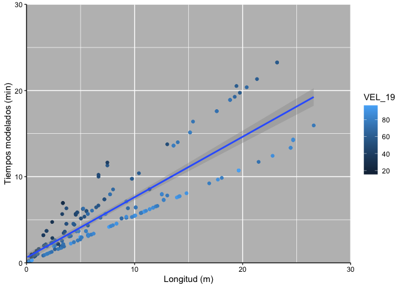

*Es posible modificar el título de la leyenda utilizando el siguiente
código*

``` r
calibracion %>%
  group_by(LENGTH, TPOS_MOD) %>%
  summarise(VEL_19 = sum(VEL_19)/n()) %>%
  ggplot(aes(LENGTH, TPOS_MOD)) +
  geom_point(aes(color = VEL_19, group =VEL_19))+
  geom_smooth(method = "lm")+
theme(axis.text = element_text(color = "black"),
      axis.line = element_line(color = "black"),
      panel.background = element_rect(fill = "gray"))+
scale_x_continuous("Longitud (m)",
                   limits = c(0,30),
                   expand = c(0,0)) +
  scale_y_continuous("Tiempos modelados (min)",
                     limits = c(0,30),
                     expand = c(0,0)) +
  labs(color = "Velocidad")
```

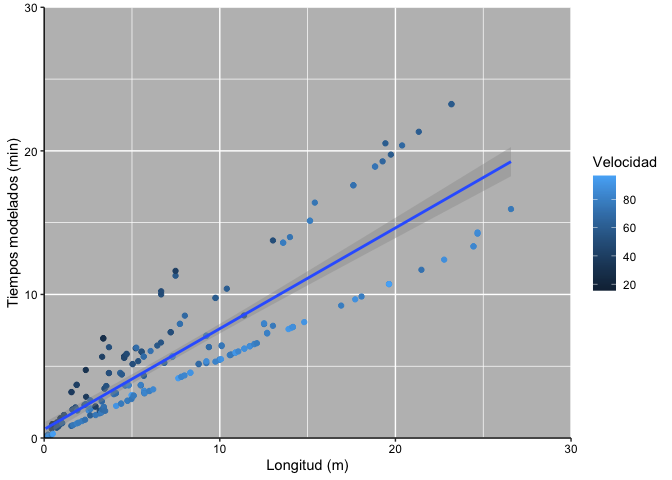

### Análisis sobre el censo

``` r
censo_cdmx <- read.csv("../data/censo.csv")

censo_filtro <- censo_cdmx %>% #Select variables
  filter(NOM_LOC == "Total del municipio") %>%
  select("NOM_MUN","VIVPAR_DES", "TVIVPAR", "POBTOT", "P_0A2", "P_3A5", "P_6A11", "P_12A14",
         "P_15A17", "P_18A24", "P_60YMAS")

censo_nom <- censo_filtro %>% #Split in characters
  select("NOM_MUN")

censo_number <- censo_filtro %>% #Separate characters that should be numbers
  select(- c("NOM_MUN"))

censo_number_n <- as.data.frame(apply(censo_number, 2, as.numeric))

censo_trabajo <- cbind(censo_nom, censo_number_n)

censo_trabajo_final <- censo_trabajo%>% #Estimated population between
  #                                       25 and 60 years old
  mutate(P_25A59 = POBTOT - (P_0A2 + P_3A5 + P_6A11 + P_12A14 +
                             P_15A17 + P_18A24 + P_60YMAS))

censo_trabajo_final <- censo_trabajo_final%>% #Estimate % uninhabited house
  mutate(PCT_VIVPAR_DES = VIVPAR_DES / TVIVPAR)

censo_trabajo_final %>%
  ggplot() + 
  geom_col(aes(x = reorder(NOM_MUN, P_25A59), y =  P_25A59, fill = PCT_VIVPAR_DES)) +
  coord_flip()+
  scale_y_continuous("Habitantes de entre 25 y 59 años")+
  scale_fill_continuous("% de viviendas deshabitadas")
```

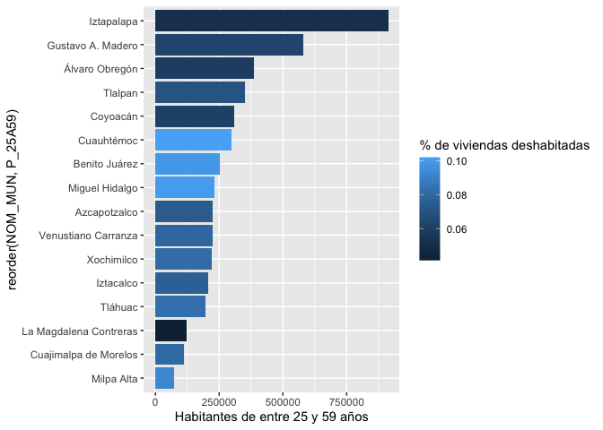

``` r
censo_trabajo_final %>%
  ggplot() + 
  geom_col(aes(x = reorder(NOM_MUN, PCT_VIVPAR_DES), y =  PCT_VIVPAR_DES, fill = P_25A59)) +
  coord_flip() +
  scale_y_continuous("Porcentaje de viviendas particulares deshabitadas") +
  scale_fill_continuous("Hab. de entre 25 y 59 años")
```

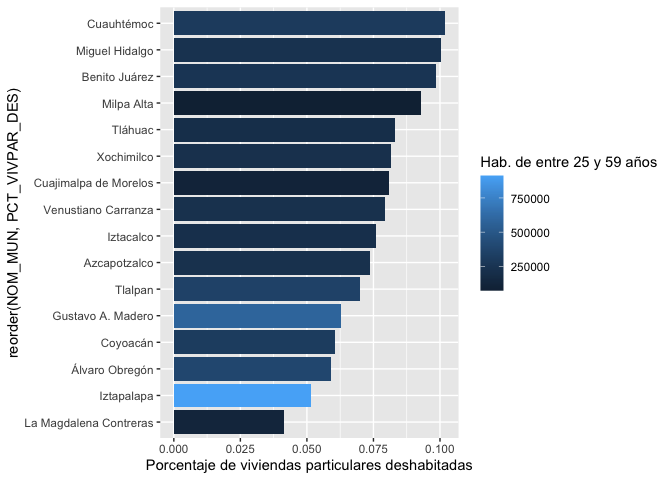

*De la misma forma que con el ejemplo anterior, es posible modificar el
título del eje x, que aparece en el eje vertical debido a la función
coord\_flip(), sería más práctico utilizar la función labs() ya que las
funciones scale\_ solo fueron utilizadas para modificar el nombre de los
ejes. La función labs() es una abreviación de “labels”*

``` r
censo_trabajo_final %>%
  ggplot() + 
  geom_col(aes(x = reorder(NOM_MUN, PCT_VIVPAR_DES), y =  PCT_VIVPAR_DES, fill = P_25A59)) +
  coord_flip() +
  labs(x = "Alcaldía",
       y = "Porcentaje de viviendas particulares deshabitadas",
       fill = "Hab. de entre 25 y 59 años")
```

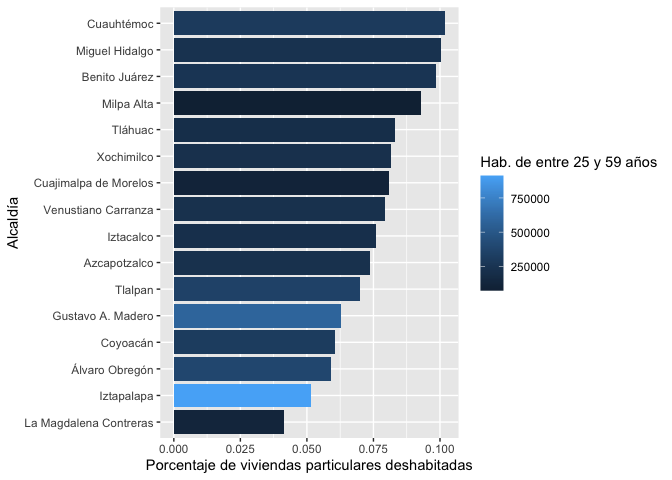

### Uso del combustible en el parque automotor de Colombia (base de datos privada, comparto el código)

``` r
library(viridis)
library(hrbrthemes)
library(ggplot2)
DATA <- read.csv("BPAR2")  ### <- asignación

#3. Gráfica distribución por combustible
ggplot(DATA, aes(x=Modelo, y=Cantidad, fill=Combustible)) + 
  geom_area(alpha=0.6 , size=.5, colour="white") +
  scale_fill_viridis(discrete = T) +
  theme_ipsum() + 
  xlim(1990, 2030)
ggtitle("The race between ...")
```


``` r
#4. Gráfica distribución por clase
ggplot(DATA, aes(x=Modelo, y=Cantidad, fill=Clase)) + 
  geom_area(alpha=0.6 , size=.5, colour="white") +
  scale_fill_viridis(discrete = T) +
  theme_ipsum() + 
  xlim(1980, 2020)
```


*No tuvimos acceso a estos datos, pero las gráficas muestran la
información de manera adecuada*

### Otra del censo

``` r
censo <- read_csv("../data/censo.csv")

censo_mx <- censo%>%
  filter(MZA!="000")

censo_mx_id <- censo_mx%>%
  select("NOM_MUN","AGEB","MZA")

censo_mx_id2 <- censo_mx%>%
  select("NOM_ENT","NOM_LOC")

censo_mx_datos <- censo_mx%>%
  select(-c("NOM_MUN","AGEB","MZA"))

censo_mx_datos2 <- censo_mx%>%
  select(-c("NOM_MUN","AGEB","MZA","NOM_ENT","NOM_LOC"))

censo_mx_num <- sapply(censo_mx_datos,function(y)as.numeric(gsub("\\*","0",y)))%>%
  as.data.frame()
censo_mx_num2 <- sapply(censo_mx_datos2,function(y)as.numeric(gsub("\\*","0",y)))%>%
  as.data.frame()
censo_mx_bind2 <- cbind(censo_mx_id,censo_mx_id2,censo_mx_num2)
#Visualización

censo_mx_bind2%>%
  group_by(NOM_MUN)%>%
  summarise(POBTOT=sum(POBTOT))%>%
  ggplot()+
  geom_col(aes(x=POBTOT,y=NOM_MUN))
```

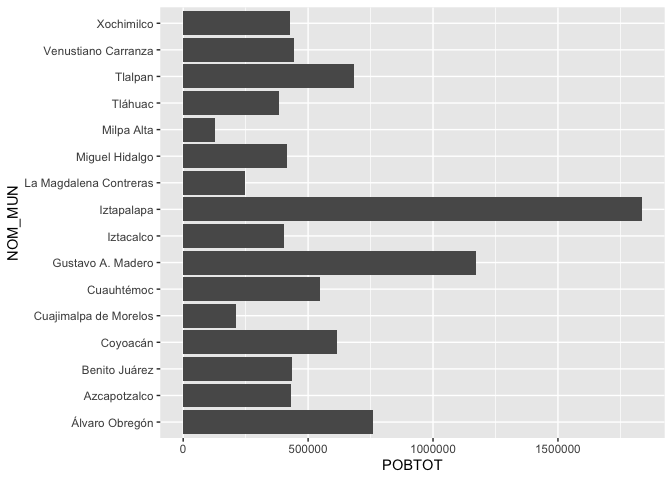

``` r
censo_mx_bind2%>%
  group_by(NOM_MUN)%>%
  summarise_at(vars(VIVTOT,POCUPADA,PNACENT),sum, na.rm = TRUE)%>%
  mutate(PCT_NACENT = PNACENT/POCUPADA)%>%
  ggplot()+
  geom_col(aes(x=reorder(NOM_MUN,POCUPADA), y=POCUPADA,fill=PCT_NACENT))+
  coord_flip()
```

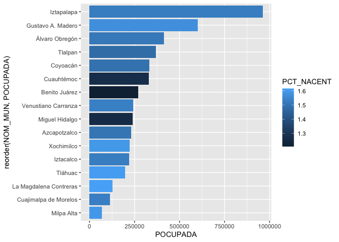

``` r
censo_mx_bind2%>%
  group_by(NOM_MUN)%>%
  summarise_at(vars(VIVTOT,POBTOT,POCUPADA),sum, na.rm = TRUE)%>%
  mutate(pct_pocup = paste(round(POCUPADA/POBTOT*100,2),"%"))%>%
  ggplot()+
  geom_col(aes(x=reorder(NOM_MUN,POBTOT), y=POBTOT,fill=pct_pocup))+
  coord_flip()
```


*En la segunda gráfica, al añadir el símbolo de porcentaje a la variable
estimada de población ocupada, se convierte en tipo carácter, por lo que
R la trata como variable categórica. Y se pierde la relación entre la
tonalidad de las barras. Utilizando el paquete scales, podemos alterar
la escala mostrada del porcentaje, sin necesidad de alterar los valores
de la tabla.*

``` r
library(scales)
censo_mx_bind2%>%
  group_by(NOM_MUN)%>%
  summarise_at(vars(VIVTOT,POBTOT,POCUPADA),sum, na.rm = TRUE)%>%
  mutate(pct_pocup = round(POCUPADA/POBTOT,2))%>%
  ggplot()+
  geom_col(aes(x=reorder(NOM_MUN,POBTOT), y=POBTOT,fill=pct_pocup))+
  coord_flip() +
  labs(x = "Alcaldía",
       y = "Población Total") +
  scale_fill_gradient(limits = c(0.5, 0.65), labels = percent)
```

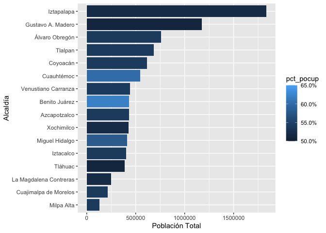

### Mas sobre el censo

``` r
censo %>%
  group_by(NOM_MUN) %>%
  summarise(POBTOT=sum(POBTOT)) %>%
  ggplot()+
  geom_col(aes(x =NOM_MUN, y=POBTOT)) +
  coord_flip()
```

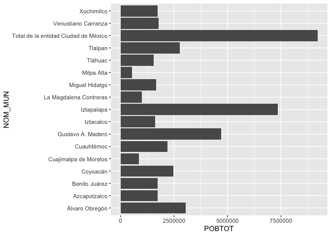

``` r
censo_tlalpan<-filter(censo, MUN == "012")
censo_tlalpan_select<-select(censo_tlalpan, MUN, NOM_MUN, AGEB, NOM_LOC, MZA, VIVTOT, POBTOT, POBFEM, POBMAS)

censo_tlalpan_select %>%
  filter(MZA != "000") %>% 
  group_by(NOM_LOC) %>%
  summarise(POBTOT=sum(POBTOT)) %>%
  ggplot()+
  geom_col(aes(x =NOM_LOC, y=POBTOT)) +
  coord_flip()
```

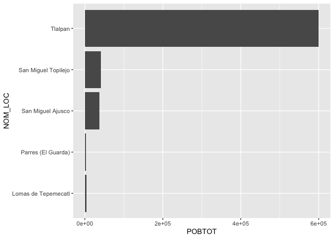

``` r
hist(calibracion$TYPE_LINK, xlab = "Tipo de enlace", ylab = "Frecuencia" , main = "Frecuancia vs Tipo de enlace" , breaks = 10 )
```

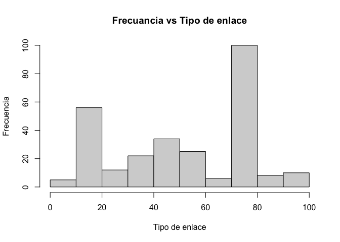

``` r
ggplot(calibracion, aes( x = LENGTH, y = VEL_19 )) + geom_point(aes (col = TYPE_LINK , size = VOLTOTAL)) + labs(x = "Longitud", y = "Velocidad")
```

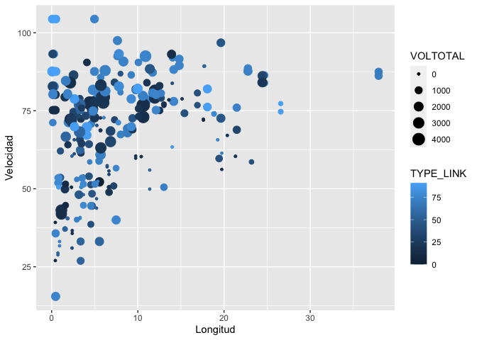

``` r
calibracion$CLASE <- ifelse(calibracion$VEL_19 >50, "ALTA VELOCIDAD" , "BAJA VELOCIDAD" )
data <- calibracion[order(calibracion$CLASE), ]
ggplot(data, aes(x = VEL_19 , y = CLASE , label = CLASE)) + 
  geom_bar(stat='identity', aes(fill=CLASE), width=.5)  +
  scale_fill_manual(name="Mileage", 
                    labels = c("Baja velocidad", "Alta velocidad"), 
                    values = c("Alta"="#00ba38", "Baja"="#f8766d")) + 
  labs(subtitle="Normalised mileage from 'CLASE'", 
       title= "Diverging Bars") + 
  coord_flip()
```

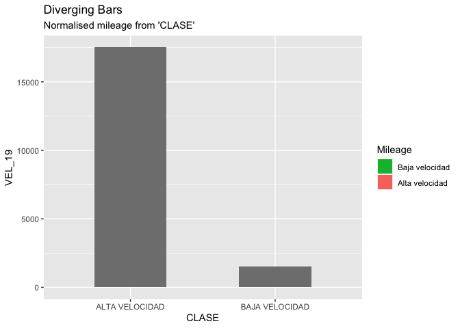

*En la última gráfica es redundante definir de forma manual las escalas*

``` r
ggplot(data, aes(x = VEL_19 , y = CLASE , color = CLASE)) + 
  geom_bar(stat='identity', aes(fill=CLASE), width=.5)+ 
  labs(subtitle="Normalised mileage from 'CLASE'", 
       title= "Diverging Bars") + 
  coord_flip()
```

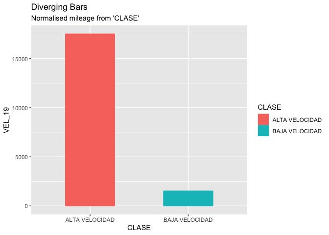

2.  Tratar de reproducir el siguiente histograma (extra) Pista: revisar
    función **facet\_wrap()**

``` r
copexa <- read_excel("../data/COPEXA_ejemplo.xlsx")
copexa %>% 
  mutate(year = format(fecha, format = "%Y")) %>% 
  group_by(year) %>% 
  ggplot(aes(AUTO, fill = activo)) +
  geom_histogram(position = "dodge") +
  facet_wrap(~year)
```

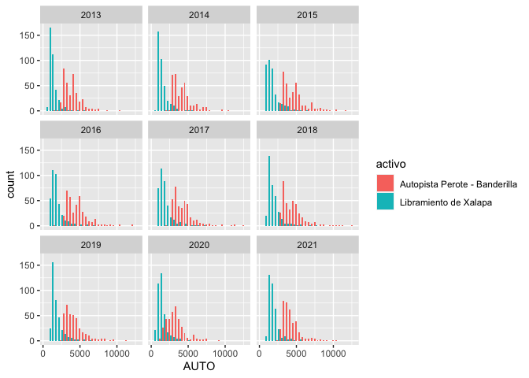
