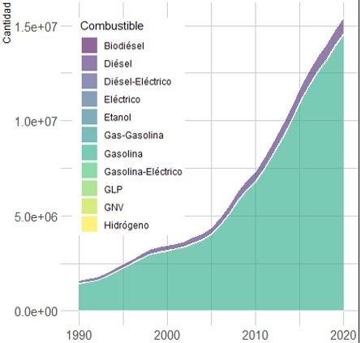

Compilado de ejercicios
================
Curso de R
2022-05-06

En este documento se compilan las visualizaciones realizadad en la
primera edición del curso de introducción a R, impartido del 25 al 29 de
mayo de 2022. Para generarlo, se utilizó RMarkdown, un lenguaje basado
en texto que entiende los comandos de R. Si desean sabes más sobre como
generar este tipo de documentos, pueden consultar en
[Rmarkdown](https://bookdown.org/yihui/rmarkdown/)

## Ejercicios

1.  Storytelling: Elegir una base de datos de las tres utilizadas
    durante el curso (censo, copexa y tiempos de calibración) y generar
    dos gráficos significativos y auto-explicativos.

### Calibración de tiempos observados y estimados

``` r
calibracion <- read_excel("../data/tiempos_calibracion.xlsx")

calibracion %>%
  group_by(LENGTH, TPOS_MOD) %>%
  summarise(VEL_19 = sum(VEL_19)/n()) %>%
  ggplot(aes(LENGTH, TPOS_MOD)) +
  geom_point(aes(color = VEL_19, group =VEL_19))+
  geom_smooth(method = "lm")+
theme(axis.text = element_text(color = "black"),
      axis.line = element_line(color = "black"),
      panel.background = element_rect(fill = "gray"))+
scale_x_continuous("Longitud (m)",
                   limits = c(0,30),
                   expand = c(0,0)) +
  scale_y_continuous("Tiempos modelados (min)",
                     limits = c(0,30),
                     expand = c(0,0))
```


### Análisis sobre el censo

``` r
censo_cdmx <- read.csv("../data/censo.csv")

censo_filtro <- censo_cdmx %>% #Select variables
  filter(NOM_LOC == "Total del municipio") %>%
  select("NOM_MUN","VIVPAR_DES", "TVIVPAR", "POBTOT", "P_0A2", "P_3A5", "P_6A11", "P_12A14",
         "P_15A17", "P_18A24", "P_60YMAS")

censo_nom <- censo_filtro %>% #Split in characters
  select("NOM_MUN")

censo_number <- censo_filtro %>% #Separate characters that should be numbers
  select(- c("NOM_MUN"))

censo_number_n <- as.data.frame(apply(censo_number, 2, as.numeric))

censo_trabajo <- cbind(censo_nom, censo_number_n)

censo_trabajo_final <- censo_trabajo%>% #Estimated population between
  #                                       25 and 60 years old
  mutate(P_25A59 = POBTOT - (P_0A2 + P_3A5 + P_6A11 + P_12A14 +
                             P_15A17 + P_18A24 + P_60YMAS))

censo_trabajo_final <- censo_trabajo_final%>% #Estimate % uninhabited house
  mutate(PCT_VIVPAR_DES = VIVPAR_DES / TVIVPAR)

censo_trabajo_final %>%
  ggplot() + 
  geom_col(aes(x = reorder(NOM_MUN, P_25A59), y =  P_25A59, fill = PCT_VIVPAR_DES)) +
  coord_flip()+
  scale_y_continuous("Habitantes de entre 25 y 59 años")+
  scale_fill_continuous("% de viviendas deshabitadas")
```


``` r
censo_trabajo_final %>%
  ggplot() + 
  geom_col(aes(x = reorder(NOM_MUN, PCT_VIVPAR_DES), y =  PCT_VIVPAR_DES, fill = P_25A59)) +
  coord_flip() +
  scale_y_continuous("Porcentaje de viviendas particulares deshabitadas") +
  scale_fill_continuous("Hab. de entre 25 y 59 años")
```


### Uso del combustible en el parque automotor de Colombia (base de datos privada, comparto el código)

``` r
library(viridis)
library(hrbrthemes)
library(ggplot2)
DATA <- read.csv("BPAR2")  ### <- asignación

#3. Gráfica distribución por combustible
ggplot(DATA, aes(x=Modelo, y=Cantidad, fill=Combustible)) + 
  geom_area(alpha=0.6 , size=.5, colour="white") +
  scale_fill_viridis(discrete = T) +
  theme_ipsum() + 
  xlim(1990, 2030)
ggtitle("The race between ...")
```



``` r
#4. Gráfica distribución por clase
ggplot(DATA, aes(x=Modelo, y=Cantidad, fill=Clase)) + 
  geom_area(alpha=0.6 , size=.5, colour="white") +
  scale_fill_viridis(discrete = T) +
  theme_ipsum() + 
  xlim(1980, 2020)
```


### Otra del censo

``` r
censo <- read_csv("../data/censo.csv")

censo_mx <- censo%>%
  filter(MZA!="000")

censo_mx_id <- censo_mx%>%
  select("NOM_MUN","AGEB","MZA")

censo_mx_id2 <- censo_mx%>%
  select("NOM_ENT","NOM_LOC")

censo_mx_datos <- censo_mx%>%
  select(-c("NOM_MUN","AGEB","MZA"))

censo_mx_datos2 <- censo_mx%>%
  select(-c("NOM_MUN","AGEB","MZA","NOM_ENT","NOM_LOC"))

censo_mx_num <- sapply(censo_mx_datos,function(y)as.numeric(gsub("\\*","0",y)))%>%
  as.data.frame()
censo_mx_num2 <- sapply(censo_mx_datos2,function(y)as.numeric(gsub("\\*","0",y)))%>%
  as.data.frame()

censo_mx_bind2 <- cbind(censo_mx_id,censo_mx_id2,censo_mx_num2)

censo_mx_bind2%>%
  mutate(pct_pocup = paste(round(POCUPADA/POBTOT*100,2),"%"))%>%
  head(5)
```

    ##        NOM_MUN AGEB MZA          NOM_ENT      NOM_LOC ENTIDAD MUN LOC POBTOT
    ## 1 Azcapotzalco 0010 001 Ciudad de México Azcapotzalco       9   2   1    159
    ## 2 Azcapotzalco 0010 002 Ciudad de México Azcapotzalco       9   2   1    145
    ## 3 Azcapotzalco 0010 003 Ciudad de México Azcapotzalco       9   2   1    124
    ## 4 Azcapotzalco 0010 004 Ciudad de México Azcapotzalco       9   2   1    158
    ## 5 Azcapotzalco 0010 005 Ciudad de México Azcapotzalco       9   2   1    154
    ##   POBFEM POBMAS P_0A2 P_0A2_F P_0A2_M P_3YMAS P_3YMAS_F P_3YMAS_M P_5YMAS
    ## 1     86     73     0       0       0     158        85        73     157
    ## 2     80     65     0       0       0     143        79        64     140
    ## 3     64     60     4       3       0     120        61        59     119
    ## 4     83     75     3       0       0     155        81        74     153
    ## 5     86     68     5       4       0     149        82        67     146
    ##   P_5YMAS_F P_5YMAS_M P_12YMAS P_12YMAS_F P_12YMAS_M P_15YMAS P_15YMAS_F
    ## 1        84        73      151         78         73      149         77
    ## 2        78        62      126         70         56      124         69
    ## 3        61        58      108         58         50      105         57
    ## 4        80        73      147         78         69      143         78
    ## 5        80        66      141         77         64      139         76
    ##   P_15YMAS_M P_18YMAS P_18YMAS_F P_18YMAS_M P_3A5 P_3A5_F P_3A5_M P_6A11
    ## 1         72      144         74         70     0       0       0      5
    ## 2         55      117         64         53     4       0       0     13
    ## 3         48      102         55         47     0       0       0     10
    ## 4         65      140         76         64     0       0       0      6
    ## 5         63      133         72         61     5       4       0      3
    ##   P_6A11_F P_6A11_M P_8A14 P_8A14_F P_8A14_M P_12A14 P_12A14_F P_12A14_M
    ## 1        5        0      6        5        0       0         0         0
    ## 2        7        6     11        6        5       0         0         0
    ## 3        3        7      8        0        6       3         0         0
    ## 4        0        4      6        0        6       4         0         4
    ## 5        0        0      4        0        0       0         0         0
    ##   P_15A17 P_15A17_F P_15A17_M P_18A24 P_18A24_F P_18A24_M P_15A49_F P_60YMAS
    ## 1       5         3         0      21        13         8        39       43
    ## 2       7         5         0      16         9         7        36       34
    ## 3       3         0         0       9         3         6        29       27
    ## 4       3         0         0      16         8         8        37       48
    ## 5       6         4         0      12         6         6        36       50
    ##   P_60YMAS_F P_60YMAS_M REL_H_M POB0_14 POB15_64 POB65_MAS PROM_HNV PNACENT
    ## 1         22         21   84.88      10      112        37     1.83     138
    ## 2         22         12   81.25      21       98        26     1.96     133
    ## 3         15         12   93.75      19       81        24     1.83     111
    ## 4         26         22   90.36      15      101        42     2.03     137
    ## 5         30         20   79.07      15       98        41     1.71     131
    ##   PNACENT_F PNACENT_M PNACOE PNACOE_F PNACOE_M PRES2015 PRES2015_F PRES2015_M
    ## 1        74        64     21       12        9      157         84         73
    ## 2        70        63     12       10        0      139         78         61
    ## 3        56        55     13        8        5      112         57         55
    ## 4        73        64     20       10       10      152         80         72
    ## 5        73        58     23       13       10      143         78         65
    ##   PRESOE15 PRESOE15_F PRESOE15_M P3YM_HLI P3YM_HLI_F P3YM_HLI_M P3HLINHE
    ## 1        0          0          0        0          0          0        0
    ## 2        0          0          0        0          0          0        0
    ## 3        7          4          3        0          0          0        0
    ## 4        0          0          0        0          0          0        0
    ## 5        3          0          0        0          0          0        0
    ##   P3HLINHE_F P3HLINHE_M P3HLI_HE P3HLI_HE_F P3HLI_HE_M P5_HLI P5_HLI_NHE
    ## 1          0          0        0          0          0      0          0
    ## 2          0          0        0          0          0      0          0
    ## 3          0          0        0          0          0      0          0
    ## 4          0          0        0          0          0      0          0
    ## 5          0          0        0          0          0      0          0
    ##   P5_HLI_HE PHOG_IND POB_AFRO POB_AFRO_F POB_AFRO_M PCON_DISC PCDISC_MOT
    ## 1         0        0        5          0          4        11          5
    ## 2         0        0        0          0          0         5          5
    ## 3         0        0        0          0          0         6          4
    ## 4         0        0        0          0          0        16         12
    ## 5         0        0        0          0          0         6          3
    ##   PCDISC_VIS PCDISC_LENG PCDISC_AUD PCDISC_MOT2 PCDISC_MEN PCON_LIMI PCLIM_CSB
    ## 1          3           0          6           0          0        20         7
    ## 2          0           0          0           0          0        16         6
    ## 3          0           0          0           0          0        12         4
    ## 4          4           3          4           4          3        23         7
    ## 5          0           0          0           0          0        16         7
    ##   PCLIM_VIS PCLIM_HACO PCLIM_OAUD PCLIM_MOT2 PCLIM_RE_CO PCLIM_PMEN PSIND_LIM
    ## 1        11          0         12          0           4          3       125
    ## 2         8          0          0          0           3          0       124
    ## 3         6          0          7          0           5          0       105
    ## 4        14          4         13          0           0          6       117
    ## 5         9          0          5          0           0          0       132
    ##   P3A5_NOA P3A5_NOA_F P3A5_NOA_M P6A11_NOA P6A11_NOAF P6A11_NOAM P12A14NOA
    ## 1        0          0          0         0          0          0         0
    ## 2        0          0          0         0          0          0         0
    ## 3        0          0          0         0          0          0         0
    ## 4        0          0          0         0          0          0         0
    ## 5        0          0          0         0          0          0         0
    ##   P12A14NOAF P12A14NOAM P15A17A P15A17A_F P15A17A_M P18A24A P18A24A_F P18A24A_M
    ## 1          0          0       4         0         0      17        11         6
    ## 2          0          0       6         4         0      12         8         4
    ## 3          0          0       3         0         0       3         0         0
    ## 4          0          0       3         0         0      11         6         5
    ## 5          0          0       5         3         0       7         3         4
    ##   P8A14AN P8A14AN_F P8A14AN_M P15YM_AN P15YM_AN_F P15YM_AN_M P15YM_SE
    ## 1       0         0         0        4          3          0        5
    ## 2       0         0         0        0          0          0        3
    ## 3       0         0         0        0          0          0        0
    ## 4       0         0         0        0          0          0        0
    ## 5       0         0         0        0          0          0        0
    ##   P15YM_SE_F P15YM_SE_M P15PRI_IN P15PRI_INF P15PRI_INM P15PRI_CO P15PRI_COF
    ## 1          4          0         4          3          0        12          7
    ## 2          0          0         6          6          0        13          9
    ## 3          0          0         4          0          0        14         11
    ## 4          0          0         4          3          0        19         12
    ## 5          0          0         5          4          0        12          7
    ##   P15PRI_COM P15SEC_IN P15SEC_INF P15SEC_INM P15SEC_CO P15SEC_COF P15SEC_COM
    ## 1          5         0          0          0        19          7         12
    ## 2          4         0          0          0        20         13          7
    ## 3          3         0          0          0        19          9         10
    ## 4          7         3          0          0        19         10          9
    ## 5          5         5          3          0        16          8          8
    ##   P18YM_PB P18YM_PB_F P18YM_PB_M GRAPROES GRAPROES_F GRAPROES_M PEA PEA_F PEA_M
    ## 1       97         49         48    11.75      11.30      12.24  81    32    49
    ## 2       76         36         40    10.77      10.13      11.58  62    22    40
    ## 3       64         33         31    11.50      11.32      11.71  63    27    36
    ## 4       89         45         44    11.37      11.05      11.75  73    30    43
    ## 5       93         47         46    11.91      11.50      12.40  75    33    42
    ##   PE_INAC PE_INAC_F PE_INAC_M POCUPADA POCUPADA_F POCUPADA_M PDESOCUP
    ## 1      70        46        24       77         31         46        4
    ## 2      64        48        16       57         21         36        5
    ## 3      44        30        14       61         27         34        0
    ## 4      73        47        26       70         28         42        3
    ## 5      66        44        22       71         31         40        4
    ##   PDESOCUP_F PDESOCUP_M PSINDER PDER_SS PDER_IMSS PDER_ISTE PDER_ISTEE
    ## 1          0          3      27     132       107        22          0
    ## 2          0          4      46      99        73        21          0
    ## 3          0          0      17     107        75        14          0
    ## 4          0          0      38     120       102        10          0
    ## 5          0          0      21     133       108        17          0
    ##   PAFIL_PDOM PDER_SEGP PDER_IMSSB PAFIL_IPRIV PAFIL_OTRAI P12YM_SOLT P12YM_CASA
    ## 1          0         4          0           0           0         66         61
    ## 2          0         7          0           0           0         48         49
    ## 3          4        14          0           0           0         48         32
    ## 4          3         3          0           0           0         57         59
    ## 5          4         5          0           0           0         42         75
    ##   P12YM_SEPA PCATOLICA PRO_CRIEVA POTRAS_REL PSIN_RELIG TOTHOG HOGJEF_F
    ## 1         24       124         10          0         24     48       16
    ## 2         29       123          8          0         14     42       22
    ## 3         28       102          4          0         16     32       15
    ## 4         31       127         16          0         15     42       18
    ## 5         24       135         12          0          7     45       19
    ##   HOGJEF_M POBHOG PHOGJEF_F PHOGJEF_M VIVTOT TVIVHAB TVIVPAR VIVPAR_HAB
    ## 1       32    159        45       114     49      48      49         48
    ## 2       20    145        75        70     42      42      42         42
    ## 3       17    124        56        68     33      32      32         31
    ## 4       24    158        69        89     43      42      43         42
    ## 5       26    154        70        84     45      45      45         45
    ##   VIVPARH_CV TVIVPARHAB VIVPAR_DES VIVPAR_UT OCUPVIVPAR PROM_OCUP PRO_OCUP_C
    ## 1         48         48          0         0        159      3.31       0.68
    ## 2         42         42          0         0        145      3.45       0.77
    ## 3         32         32          0         0        124      3.88       0.84
    ## 4         42         42          0         0        158      3.76       0.76
    ## 5         45         45          0         0        154      3.42       0.71
    ##   VPH_PISODT VPH_PISOTI VPH_1DOR VPH_2YMASD VPH_1CUART VPH_2CUART VPH_3YMASC
    ## 1         48          0        8         40          0          0         48
    ## 2         42          0        0         41          0          0         41
    ## 3         32          0        0         30          0          0         32
    ## 4         42          0        0         41          0          0         42
    ## 5         45          0        5         40          0          0         44
    ##   VPH_C_ELEC VPH_S_ELEC VPH_AGUADV VPH_AEASP VPH_AGUAFV VPH_TINACO VPH_CISTER
    ## 1         48          0         48        48          0         43          0
    ## 2         42          0         42        42          0         22          0
    ## 3         32          0         32        32          0         23          0
    ## 4         42          0         42        42          0         39          0
    ## 5         45          0         45        45          0         39          0
    ##   VPH_EXCSA VPH_LETR VPH_DRENAJ VPH_NODREN VPH_C_SERV VPH_NDEAED VPH_DSADMA
    ## 1        48        0         48          0         48          0         48
    ## 2        42        0         42          0         42          0         42
    ## 3        32        0         32          0         32          0         32
    ## 4        42        0         42          0         42          0         42
    ## 5        45        0         45          0         45          0         45
    ##   VPH_NDACMM VPH_SNBIEN VPH_REFRI VPH_LAVAD VPH_HMICRO VPH_AUTOM VPH_MOTO
    ## 1         25          0        48        48         32        23        3
    ## 2         15          0        42        40         31        26        3
    ## 3         16          0        30        29         26        15        3
    ## 4         14          0        40        40         29        28        0
    ## 5         17          0        45        43         32        27        0
    ##   VPH_BICI VPH_RADIO VPH_TV VPH_PC VPH_TELEF VPH_CEL VPH_INTER VPH_STVP
    ## 1       15        43     46     29        45      42        39       18
    ## 2       18        36     40     27        37      38        32       14
    ## 3        6        28     32     21        29      28        25       11
    ## 4       15        39     42     25        37      38        34       14
    ## 5        9        41     45     25        42      42        38       12
    ##   VPH_SPMVPI VPH_CVJ VPH_SINRTV VPH_SINLTC VPH_SINCINT VPH_SINTIC pct_pocup
    ## 1         13       6          0          0           9          0   48.43 %
    ## 2         12       5          0          0           9          0   39.31 %
    ## 3         15       7          0          0           6          0   49.19 %
    ## 4          4       7          0          0           7          0    44.3 %
    ## 5          5       6          0          0           7          0    46.1 %

``` r
#Visualización

censo_mx_bind2%>%
  group_by(NOM_MUN)%>%
  summarise(POBTOT=sum(POBTOT))%>%
  ggplot()+
  geom_col(aes(x=POBTOT,y=NOM_MUN))
```


``` r
censo_mx_bind2%>%
  group_by(NOM_MUN)%>%
  summarise_at(vars(VIVTOT,POCUPADA,PNACENT),sum, na.rm = TRUE)%>%
  mutate(PCT_NACENT = PNACENT/POCUPADA)%>%
  ggplot()+
  geom_col(aes(x=reorder(NOM_MUN,POCUPADA), y=POCUPADA,fill=PCT_NACENT))+
  coord_flip()
```


``` r
censo_mx_bind2%>%
  group_by(NOM_MUN)%>%
  summarise_at(vars(VIVTOT,POBTOT,POCUPADA),sum, na.rm = TRUE)%>%
  mutate(pct_pocup = paste(round(POCUPADA/POBTOT*100,2),"%"))%>%
  ggplot()+
  geom_col(aes(x=reorder(NOM_MUN,POBTOT), y=POBTOT,fill=pct_pocup))+
  coord_flip()
```


2.  Tratar de reproducir el siguiente histograma (extra) Pista: revisar
    función **facet\_wrap()**
